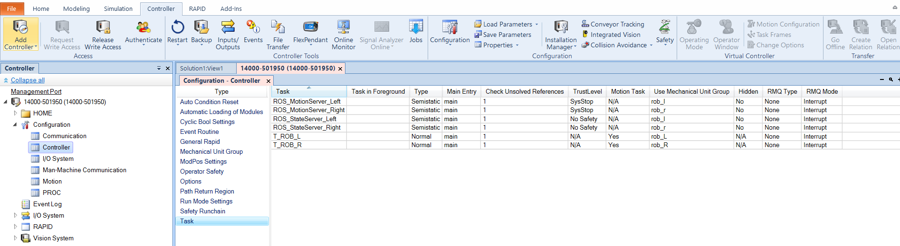

# 2.1 YuMi ROS Server

---

## 2.1.1 Introduction

---

This is to explain the components of the **ROS Server** Implemented using **RAPID** and Installed on YuMi IRB 14000.
The other implementations in python for example [Berkeley Automation](https://github.com/BerkeleyAutomation/yumipy/tree/dev_justin) use [Open ABB Driver](https://github.com/robotics/open_abb)

---

## 2.1.2 The Architecture

This server is mainly invoked from [abb_driver](https://github.com/ros-industrial/abb_driver) library, the **system components** core are almost the same, while they vary in the small details from Repository to another:
- [ROS_common](https://github.com/ros-industrial/abb_driver/blob/melodic-devel/rapid/ROS_common.sys)
- [ROS_messages](https://github.com/ros-industrial/abb_driver/blob/melodic-devel/rapid/ROS_messages.sys)
- [ROS_socket](https://github.com/ros-industrial/abb_driver/blob/melodic-devel/rapid/ROS_socket.sys)

While the **State the Motion components** are **duplicated** to serve two arms arm, with small changes in the State and Motion Servers (Left and Right):

- [ROS_stateServer](https://github.com/ros-industrial/abb_driver/blob/melodic-devel/rapid/ROS_stateServer.mod), Left `port 11002`, Right `port 12002`
- [ROS_motionServer](https://github.com/ros-industrial/abb_driver/blob/melodic-devel/rapid/ROS_motionServer.mod), Left `port 11000`, Right `port 12000`
- [ROS_motion](https://github.com/ros-industrial/abb_driver/blob/melodic-devel/rapid/ROS_motion.mod)

---

### 2.1.2 a-) ROS_common
> Common constants to be used.

This file defines **two data structures**: 
- `ROS_joint_trajectory_pt` (which includes joints `jointtarget`, and duration `num`)
- `ROS_gripper_trajectory_pt`, (which includes gripper_pos `num`)

And defines the **maximum trajectory length = 100 points**, also it includes a **lock protection** to prevent conflicts, and four levels of speed:
- `SLOW_SPEED`
- `NORM_SPEED`
- `MED_SPEED`
- `FAST_SPEED`

In addition to some constants.

---

### 2.1.2 b-) ROS_socket
> This is to define the communication using UDP socket

This script defines four functions, namely:
1. `ROS_init_socket(VAR socketdev server_socket, num port)` To initialize the socket.
2. `ROS_wait_for_client(VAR socketdev server_socket, VAR socketdev client_socket, VAR string task_name \num wait_time)` To Listen for clients and accept their connection.
3. `ROS_receive_msg(VAR socketdev client_socket, VAR ROS_msg message, \num wait_time)` To receive a message to the buffer of the type `ROS_msg` defined in the `ROS_messages.sys` script. 
4. `ROS_send_msg(VAR socketdev client_socket, VAR ROS_msg message)` To send a message to the buffer.

---

### 2.1.2 c-) ROS_messages
> Message structure is defined here to conform with [simple_message](http://wiki.ros.org/simple_message) package.

**Data Structure**

This file includes different data structures:
1. `ROS_msg_header`: This header record confronts with [simple_message.h](https://github.com/ros-industrial/industrial_core/blob/melodic-devel/simple_message/include/simple_message/simple_message.h#L56), and includes:
    - Message type `msg_type`: `INVALID`, `JOINT` (for feedback), or `JOINT_TRAJ_PT` (for path downloading).
    - Communication type `comm_type`: `TOPIC`, `SRV_REQ`, or `SRV_REPLY`.
    - Reply code `reply_code`: `INVALID`, `SUCCESS`, or `FAILURE`.
2. `ROS_msg`: This record simply includes the header and the raw `rawbytes` data.
3. `ROS_msg_joint_data`: This record includes the header, the joint sequence id, and the `jointtarget` component called **joints**.
4. `ROS_msg_joint_traj_pt`: in addition to the fields mentioned in `3` this record includes the `velocity` and the `duration`.
5. `ROS_msg_gripper_data`: This record is similar to `3`, except that the joints are replaced with gripper **position**.    
6. `ROS_msg_traj_pt`: This record is general, it combines `4` and `5`, note that gripper ~~position~~ is replaced with **gripperTarget** here.

- Note that the joints here are in `degree`.

**Procedures**

> *Without the Gripper*

1. `ROS_receive_msg_joint_traj_pt(VAR socketdev client_socket, VAR ROS_msg_joint_traj_pt jointMessage, \num wait_time)`,The purpose is to receive joint states from ROS and store the values.
2. `ROS_send_msg_joint_data(VAR socketdev client_socket, ROS_msg_joint_data jointMessage)`, The purpose is to send joint states to ROS.

> *With the Gripper*

1. `ROS_receive_msg_gripper_traj_pt(VAR socketdev client_socket, VAR ROS_msg_traj_pt message, \num wait_time)`,The purpose is to receive joint states from ROS and store the values.
2. `ROS_send_msg_gripper_data(VAR socketdev client_socket, ROS_msg_joint_data jointMessage, ROS_msg_gripper_data gripperMessage)`, The purpose is to send joint states to ROS.

---

### 2.1.2 d-) ROS_stateServer

This script establishes a socket connection, and sends the Joints state and the gripper state using a Topic message of the type: `ROS_send_msg_gripper_data`.

---

### 2.1.2 e-) ROS_motionServer

This script establishes a socket connection, and calls the procedure `ROS_receive_msg_gripper_traj_pt` to receive a message of the type `ROS_msg_traj_pt`, and sends a reply of type `JOINT_TRAJ_PT`, (if requested by a service).
- Note that the delay to start the motion servers is different between the two arms.

---

### 2.1.2 f-) ROS_motion

---

## ROS Server Setup On YuMi Using RobotStudio

This [Wiki](https://github.com/ethz-asl/yumi/wiki/Setting-Up-YuMi-in-RobotStudio), and this [Handbook](https://www.researchgate.net/publication/344386051_HandBook_Guidance_on_the_programming_of_ABB_YuMi_IRB_14000) explain the setup in well manner.

However, the final configuration will look like this:

